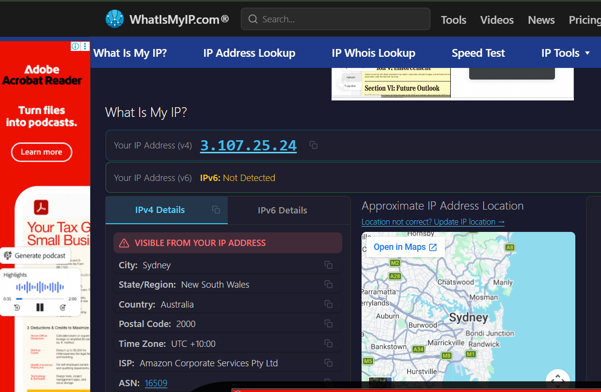

# Self-Hosted WireGuard VPN on AWS

A self-hosted VPN infrastructure deployed on **Amazon Web Services (AWS)** using **WireGuard, Ubuntu Linux, VPC networking, IP forwarding, and NAT**.

The project routes a Windows client's IPv4 internet traffic through an encrypted WireGuard tunnel to an **Amazon EC2 instance in the AWS Asia Pacific (Sydney) Region**, making the AWS server the client's internet egress point.

This project was built manually to gain hands-on experience with AWS networking and Linux administration while preparing for the **AWS Certified Solutions Architect – Associate (SAA)** certification.

---

## Architecture


### Traffic Flow

```text
Windows VPN Client
        │
        │ Encrypted WireGuard Tunnel
        │ UDP 51820
        ▼
AWS EC2 — Sydney
        │
        │ WireGuard Decryption
        ▼
Linux IP Forwarding
        │
        ▼
iptables NAT / MASQUERADE
        │
        ▼
Public Subnet Route
0.0.0.0/0 → Internet Gateway
        │
        ▼
Internet
```

The VPN client uses the private WireGuard address `10.10.0.2`, while the EC2 WireGuard interface uses `10.10.0.1`.

When the VPN is active, IPv4 internet traffic exits through the AWS EC2 instance rather than directly through the client's normal ISP connection.

---

## Project Highlights

- Built a custom AWS VPC instead of relying on the default VPC
- Created and configured a public subnet, route table, and Internet Gateway
- Deployed an Ubuntu EC2 instance in the Sydney AWS Region
- Configured Security Group rules for SSH and WireGuard
- Installed and configured a self-hosted WireGuard VPN server
- Implemented public/private key-based VPN authentication
- Enabled Linux IPv4 forwarding
- Configured NAT using `iptables MASQUERADE`
- Disabled EC2 source/destination checking for packet forwarding
- Configured a Windows WireGuard client as a full-tunnel IPv4 VPN
- Verified successful WireGuard handshakes and bidirectional traffic
- Verified that the client's public IPv4 changed to the AWS EC2 public IPv4
- Practiced real-world troubleshooting across AWS, Linux, SSH, routing, and VPN layers

---

## Technologies Used

### AWS

- Amazon EC2
- Amazon VPC
- Public Subnet
- Internet Gateway
- Route Tables
- Security Groups

### Networking & Systems

- WireGuard
- Ubuntu Linux
- SSH
- IPv4 / CIDR
- Linux IP Forwarding
- `iptables`
- NAT / MASQUERADE
- UDP
- Public/private key cryptography

### Client

- Windows
- WireGuard for Windows
- PowerShell

---

## Network Design

The project uses two separate private network spaces.

| Network | CIDR / Address | Purpose |
|---|---|---|
| AWS VPC | `10.0.0.0/16` | AWS infrastructure network |
| Public Subnet | `10.0.1.0/24` | Hosts the VPN EC2 instance |
| WireGuard Network | `10.10.0.0/24` | Private VPN tunnel network |
| WireGuard Server | `10.10.0.1` | EC2 WireGuard interface |
| WireGuard Client | `10.10.0.2` | Windows VPN client |

The **VPC network and WireGuard network are separate networks**.

The VPC provides AWS infrastructure connectivity, while the `10.10.0.0/24` network provides addressing inside the encrypted WireGuard tunnel.

---

## AWS Networking Architecture

A custom VPC was created with:

```text
VPC
10.0.0.0/16
│
└── Public Subnet
    10.0.1.0/24
        │
        └── Ubuntu EC2
            WireGuard VPN Server
```

The public subnet uses a custom route table containing:

```text
10.0.0.0/16 → local
0.0.0.0/0   → Internet Gateway
```

The `0.0.0.0/0` route provides the subnet with a path toward the Internet Gateway for destinations outside the VPC.

The EC2 instance has the required public addressing and security configuration to communicate with the VPN client over the internet.

---

## WireGuard VPN

WireGuard creates an encrypted tunnel between the Windows client and the EC2 server.

```text
Windows Client                         AWS EC2

10.10.0.2                              10.10.0.1
     │                                      │
     └──── Encrypted WireGuard Tunnel ──────┘
                    UDP 51820
```

Each peer uses its own public/private key pair.

The server knows the client's **public key**, and the client knows the server's **public key**.

Private keys remain on their respective systems and are not included in this repository.

---

## Full-Tunnel Routing

The Windows WireGuard client was configured with:

```ini
AllowedIPs = 0.0.0.0/0
```

This routes IPv4 destinations through the WireGuard tunnel.

Conceptually:

```text
Browser / Application
        │
        ▼
Windows Routing
        │
        ▼
WireGuard Tunnel
        │
        ▼
AWS EC2
        │
        ▼
Internet
```

A successful WireGuard connection alone does not guarantee that internet traffic is using the VPN.

The routing configuration must also direct the required traffic through the tunnel.

---

## IP Forwarding and NAT

The EC2 instance acts as a routing device for the VPN client.

IPv4 forwarding was enabled on Ubuntu:

```text
net.ipv4.ip_forward=1
```

This allows Linux to forward packets between the WireGuard interface and the EC2 network interface.

The VPN client's address:

```text
10.10.0.2
```

is a private IP address and cannot be routed directly across the public internet.

Therefore, the EC2 instance performs NAT using Linux `iptables MASQUERADE`.

```text
VPN Client
10.10.0.2
     │
     ▼
WireGuard
     │
     ▼
EC2
     │
     ├── IP Forwarding
     │
     └── NAT / MASQUERADE
              │
              ▼
           Internet
```

> **Note:** This project does not use an AWS NAT Gateway. NAT is performed locally by Linux on the EC2 instance using `iptables`.

---

## EC2 Source/Destination Check

EC2 instances normally have source/destination checking enabled.

A standard EC2 instance typically sends or receives traffic intended for itself.

The VPN server behaves differently because it forwards packets belonging to the VPN client:

```text
VPN Client
     │
     ▼
EC2 VPN Server
     │
     ▼
Internet
```

Source/destination checking was therefore disabled for the VPN EC2 instance to support its role as a forwarding/routing appliance.

This concept is also relevant to architectures involving:

- NAT instances
- VPN appliances
- Virtual routers
- Network security appliances

---

## Security

The EC2 instance is protected by an AWS Security Group.

The required inbound access includes:

| Protocol | Port | Purpose |
|---|---:|---|
| TCP | `22` | SSH administration |
| UDP | `51820` | WireGuard VPN |

SSH administrative access was restricted to an authorized source rather than intentionally exposing SSH globally.

Additional security practices include:

- SSH public-key authentication
- WireGuard public/private key authentication
- Restricted inbound Security Group rules
- No private keys committed to Git
- Sensitive information removed from screenshots
- Exposed credentials treated as compromised and rotated

Detailed security documentation is available in:

[`docs/security.md`](docs/security.md)

---

## Verification

The VPN was verified at multiple layers rather than relying only on the WireGuard application's "connected" status.

### 1. WireGuard Interface

The server confirmed that the WireGuard interface was active and listening on UDP port `51820`.

### 2. Peer Authentication

A recent WireGuard handshake confirmed successful cryptographic communication between the Windows client and AWS server.

Example sanitized output:

```text
interface: wg0
  public key: <SERVER_PUBLIC_KEY>
  listening port: 51820

peer: <CLIENT_PUBLIC_KEY>
  endpoint: <CLIENT_ENDPOINT>
  allowed ips: 10.10.0.2/32
  latest handshake: <RECENT>
  transfer: <RECEIVED>, <SENT>
```

### 3. Traffic Transfer

Increasing WireGuard transfer counters confirmed that data was moving through the tunnel.

### 4. Public IPv4 Verification

Before enabling the VPN:

```text
Windows Client
      │
      ▼
Normal ISP
      │
      ▼
Internet
```

After enabling the VPN:

```text
Windows Client
      │
      │ Encrypted WireGuard
      ▼
AWS Sydney EC2
      │
      ▼
Internet
```

The client's public IPv4 changed from the normal ISP address to the AWS EC2 public IPv4.

This confirmed that the EC2 instance was functioning as the internet egress point for the VPN client.

---

## Screenshots

### AWS Infrastructure

#### VPC Resource Map


#### Public Subnet


#### Route Table


#### Security Group


#### EC2 VPN Server


### VPN Verification

#### WireGuard Handshake


#### Public IP Before VPN


#### Public IP After VPN



> Screenshots published in this repository should be sanitized to remove private keys, credentials, AWS account identifiers, and personally identifying network information.

---

## Troubleshooting

Several real issues were encountered while building the project.

### SSH Authentication Failure

An SSH attempt initially returned:

```text
Permission denied (publickey)
```

Because the server responded over SSH, basic TCP connectivity was already functioning.

The issue was therefore investigated at the authentication layer rather than unnecessarily changing VPC routing.

This reinforced the importance of troubleshooting by layers.

### WireGuard Connected but Public IP Unchanged

At one stage, WireGuard established a handshake, but the client's public IP remained unchanged.

This demonstrated that:

```text
VPN Tunnel Established
        ≠
Internet Traffic Routed Through VPN
```

The full traffic path also required correct:

- Client routing
- `AllowedIPs`
- Linux IP forwarding
- NAT
- AWS routing

### SSH Connection Reset

Activating the full-tunnel VPN affected an existing SSH session because the client's routing table changed when the VPN became active.

This demonstrated how network route changes can unexpectedly affect management connections.

### Credential Rotation

A WireGuard private key was accidentally exposed during troubleshooting.

The key was treated as compromised, a new key pair was generated, and the server peer configuration was updated.

Detailed troubleshooting notes are available in:

[`docs/troubleshooting.md`](docs/troubleshooting.md)

---

## What I Learned

The biggest lesson from this project was that a working VPN depends on several independent layers operating together.

```text
AWS Infrastructure
        +
VPC Routing
        +
Security Groups
        +
WireGuard Encryption
        +
Linux IP Forwarding
        +
NAT / MASQUERADE
        +
Client Routing
        =
Working Full-Tunnel VPN
```

A failure at any layer can prevent the complete system from working.

The project also improved my ability to troubleshoot infrastructure systematically:

```text
Can I reach the EC2 instance?
        ↓
Can I authenticate with SSH?
        ↓
Is WireGuard running?
        ↓
Is UDP 51820 reachable?
        ↓
Did WireGuard establish a handshake?
        ↓
Is traffic transferring?
        ↓
Is IP forwarding enabled?
        ↓
Is NAT configured correctly?
        ↓
Is the client routing through the VPN?
        ↓
Did the public IP actually change?
```

---

## AWS SAA Concepts Practiced

This project provided hands-on practice with concepts relevant to the AWS Solutions Architect – Associate curriculum:

- Amazon VPC
- CIDR addressing
- Public subnets
- Route tables
- Default routes
- Internet Gateways
- Security Groups
- Amazon EC2
- Public vs private IP addressing
- Source/destination checks
- Network routing
- NAT concepts
- Cloud security
- Cost awareness

Instead of studying these concepts only theoretically, the project demonstrated how they interact in a working architecture.

---

## Repository Structure

```text
aws-wireguard-vpn/
│
├── README.md
├── LICENSE
├── .gitignore
│
├── architecture/
│   └── aws-vpn-architecture.png
│
├── docs/
│   ├── architecture.md
│   ├── setup-guide.md
│   ├── security.md
│   ├── troubleshooting.md
│   └── cost-analysis.md
│
├── screenshots/
│   ├── 01-vpc-resource-map.png
│   ├── 02-public-subnet.png
│   ├── 03-route-table.png
│   ├── 04-security-group.png
│   ├── 05-ec2-instance.png
│   ├── 06-wireguard-handshake.png
│   ├── 07-before-vpn.png
│   └── 08-after-vpn.png
│
├── config/
│   ├── wg0.conf.example
│   └── client.conf.example
│
└── terraform/
    └── README.md
```

---

## Documentation

Detailed technical documentation is separated from the main README:

- [Architecture Deep Dive](docs/architecture.md)
- [Complete Setup Guide](docs/setup-guide.md)
- [Security Considerations](docs/security.md)
- [Troubleshooting & Lessons Learned](docs/troubleshooting.md)
- [Cost Analysis & Resource Cleanup](docs/cost-analysis.md)

This keeps the main README focused while preserving detailed implementation and learning documentation.

---

## Cost Considerations

Potential AWS cost areas include:

- EC2 compute
- EBS storage
- Public IPv4 addressing
- Internet data transfer

The project does **not** use an AWS NAT Gateway.

Because a VPN can route significant amounts of internet traffic through AWS, bandwidth-heavy activities such as video streaming and large downloads should be considered when evaluating cost.

Resources should be stopped or removed when they are no longer required.

See:

[Cost Analysis & Resource Cleanup](docs/cost-analysis.md)

for detailed cost and cleanup considerations.

---

## Phase 2 — Infrastructure as Code with Terraform

The initial version was deliberately deployed manually through AWS to understand each infrastructure component before automating it.

The next phase will recreate the architecture using **Terraform**.

Planned Terraform-managed resources include:

- VPC
- Public subnet
- Internet Gateway
- Route table and association
- Security Group
- EC2 instance

The goal is to move from:

```text
Manual AWS Console Deployment
```

to:

```text
terraform init
        ↓
terraform plan
        ↓
terraform apply
        ↓
Reproducible Infrastructure
```

The Terraform implementation will be added under:

```text
terraform/
```

once completed and tested.

---

## Future Improvements

Planned improvements include:

- [ ] Rebuild the AWS infrastructure using Terraform
- [ ] Automate WireGuard installation using EC2 User Data
- [ ] Automate Linux IP forwarding and NAT configuration
- [ ] Add CloudWatch monitoring
- [ ] Configure AWS Budgets and billing alerts
- [ ] Investigate a stable VPN endpoint
- [ ] Add secure multi-client support
- [ ] Improve automated infrastructure cleanup
- [ ] Explore IPv6-aware VPN configuration

---

## Project Outcome

The final deployment successfully achieved:

- Working WireGuard VPN server on AWS EC2
- Encrypted client-to-server VPN communication
- Successful WireGuard handshake
- Bidirectional tunnel traffic
- Full-tunnel IPv4 routing
- Linux IP forwarding
- NAT masquerading
- Internet traffic routed through AWS
- Australian AWS internet egress
- Verified public IPv4 change

The project transformed AWS networking concepts from theory into a working cloud infrastructure deployment.

It provided hands-on experience across:

**AWS • Linux • Networking • Security • Troubleshooting**

---

## Disclaimer

This project was created for educational purposes and hands-on cloud/networking learning.

It is not presented as a production-ready or anonymity-focused VPN service.

AWS resources may incur costs depending on account eligibility, region, resource configuration, public IPv4 usage, storage, and data transfer.

All credentials, private keys, and personally identifying network information must be removed before publishing the repository.
